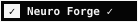
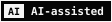
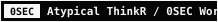

# SecondSaver

Example project used to validate the Neuro Forge badge system.

<!-- NEUROFORGE_BADGES:BEGIN -->
<!-- Generated by scripts/generate-badges.sh -->

<!-- NEUROFORGE_BADGES:END -->

## About Neuro Forge

SecondSaver is an example project for the Neuro Forge Standard v2.0.

## Support

[Buy Me a Coffee](https://buymeacoffee.com/bizcom)
